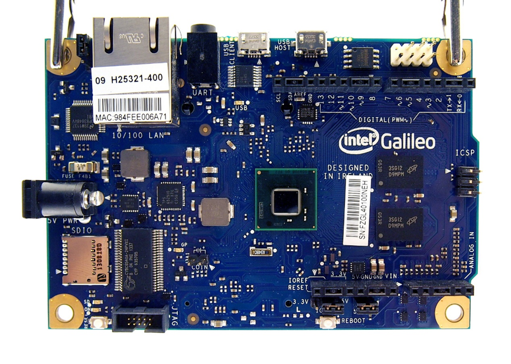
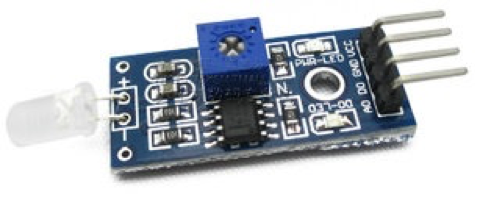
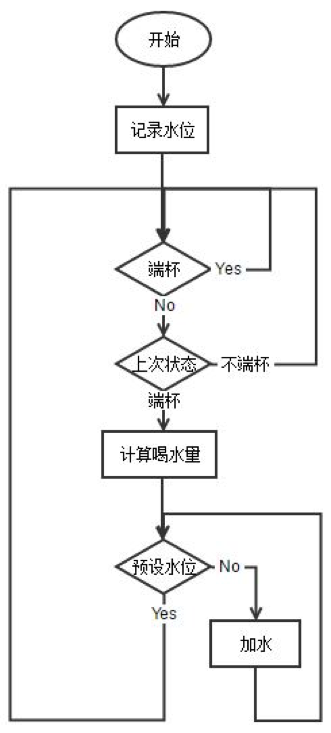
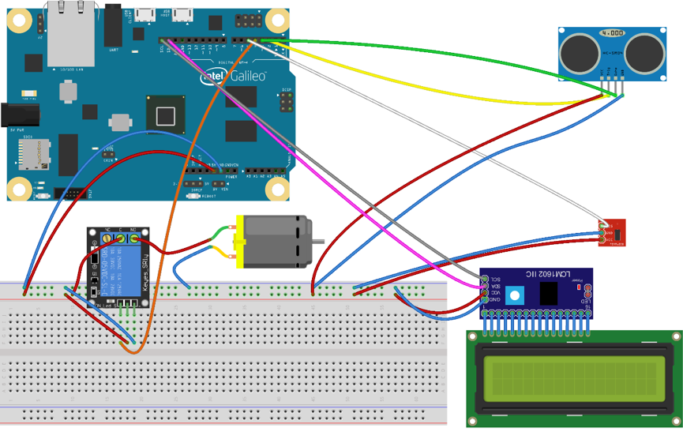

# 智能水杯

**[摘要]** 基于对目前市场上的大部分电子水杯秤的分析, 提出了一种较为新意的智能水杯设计方案. 本课题设计的智能水杯以开源硬件 Arduino 开发板为核心, 外接 HY-SRF05 超声波传感器和 JT-160 微型水泵, 不但能测量每次的喝水量, 而且能将水自动加入至水杯, 也可以连接网络再进行保存和分析得出人体健康状况.
**[关键词]** Arduino; HY-SRF05; 饮水

# 1 绪论

## 1.1 背景及意义
水是生命之源, 每个人都离不开水, 人每天也都要喝水. 这就使得智能水杯的概念具备足够吸引力, 比如让你及时喝水, 平衡体内平衡. 尤其冬天的时候, 空气干燥, 及时补水就显得尤为重要; 夏天由于大量的运动和出汗同样需要及时补水, 但是我们往往都是等到渴了才想到喝水, 那时候身体其实已经对水很渴望了. 物联网智能水杯结合人体对水的需求, 可以进行饮水量追踪, 让您时时掌握自己的饮水状况.

## 1.2 智能水杯的功能描述
1. 通过超声波传感器进行液位的精确测量
2. 可以向任意水杯中自动加水
3. 记录用户每次喝水量
4. 记录用户喝水习惯, 如何时端杯等
5. 留有网络访问的数据接口, 有强大的扩展性能

# 2 智能水杯的硬件设计
本系统硬件设计分为自动加水和测量液位两部分. 整体以 Arduino 开发板为核心, 外接 HY-SRF05 超声波传感器, JT-160 迷你微型直流无刷水泵, 光敏二极管模块, 1路继电器模块, LCD1602 液晶显示屏, LCD1602 转接板和水位传感器模块组成.

## 2.1 开源硬件 Arduino 开发板
Arduino 是一款便捷灵活, 方便上手的开源电子原型平台, 包含硬件 (各种型号的 Arduino 板) 和软件 (Arduino IDE). 他是基于开放原始代码的 Simple I/O 平台, 並且具有使用类似 Java, C 语言的开发环境. 让您可以快速使用 Arduino 语言与 Flash 或 Processing 等软件, 做出互动作品. Arduino 所使用到的软件都可以免费下载. 硬件参考设计 (CAD 文件) 也是遵循 Open-source software 协议. 你可以非常自由地根据你自己的要求去修改他们. 任何人都能在 Arduino 的网站上找到图纸, 设计文件和电路板配套的软件, 然后通过下载文档生产电路板甚至销售, 一分钱专利费也不用付.

### 2.1.1 Arduino 特点
1. 开放源代码的电路设计, 程序开发接口免费下载, 也可依需求自己修改.
2. Arduino 支持 ISP 在线烧, 可以将新的 bootloader 固件烧入芯片中. 有了 bootloader 之后, 可以通过串口或者 USB to Rs232 线更新固件。
3. 可依据官方提供的 Eagle 格式 PCB 和 SCH 电路图简化 Arduino 模组, 完成独立运作的微处理控制.
4. 支援多样的互动程序.
5. 可使用低价格的微处理控制器 (ATMEGA 8-168).

### 2.1.2 Intel Galileo
本系统使用了 Intel Galileo 开发板进行开发.



英特尔® Galileo 开发主板是基于英特尔® Quark SoC X1000 应用处理器的微控制器板, 它也是一个 32 位英特尔® 奔腾® 品牌的片上系统 (SoC). 它是第一款基于英特尔® 架构且设计为与用于 Arduino Uno R3 的防护实现硬件和软件引脚兼容的板.

此平台支持 *Microsoft Windows*, *macOS* 和 *Linux* 主机操作系统, 因此让英特尔架构开发简单易行. 它还简化了 Arduino 集成开发环境 (IDE) 软件.

此处, 英特尔 Galileo 主板与 Arduino 软件开发环境的软件兼容, 因而可以轻而易举的实现可用性和对其的推出. 除了 Arduino 硬件和软件兼容性之外, 英特尔 Galileo 主板还有多个计算机行业标准 I/O 端口, 并能将本地使用及功能扩展到 Arduino 防护生态系统以外. 全尺寸小型 PCI Express 插槽, 100 Mb 以太网端口, 微型 SD 卡插槽, 6 针 3.3V USB TTL UART 接口, USB 主机端口, USB 客户端端口和 8 MB NOR Flash 是该板的标配.

英特尔 Galileo 主板使用了 RS-232 控制台端口. Galileo 主板包括 12 位脉宽调制 (PWM), 控制台至 arduino UART1 眉的重定向, 12v 以太网供电 (PoE) 功能, 和一个接受从 7V 至 15V 电源的电源调节系统.

## 2.2 HY-SRF05


声波传感器通过超声波发射装置发出超声波, 根据接收器接到超声波时的时间差就可以知道距离. 这与雷达测距原理相似. 超声波发射器向某一方向发射超声波, 在发射时刻的同时开始计时, 超声波在空气中传播, 途中碰到障碍物就立即返回来, 超声波接收器收到反射波就立即停止计时. (超声波在空气中的传播速度为 340m/s, 根据计时器记录的时间t, 就可以计算出发射点距障碍物的距离(s), 即: s=340t/2). 本模块性能稳定, 测度距离精确.

为了使水杯感应到水面高度, 就必须装备测距系统, 以使其及时获取距障碍物的距离信息.

### 2.2.1 HY-SRF05 模块主要技术参数
1. 使用电压：DC5V
2. 静态电流：小于2mA
3. 电平输出：高5V
4. 电平输出：低0V
5. 感应角度：不大于15度
6. 探测距离：2cm-450cm
7. 高精度可达 0.2cm

### 2.2.2 模块工作方式


1. 采用 IO 触发测距, 给至少 10us 的高电平信号;
2. 模块自动发送 8 个 40khz 的方波, 自动检测是否有信号返回;
3. 有信号返回, 通过IO输出一高电平, 高电平持续的时间就是超声波从发射到返回的时间. 测试距离 = (高电平时间 * 声速(340M/S) ) / 2;

## 2.3 光敏二极管模块
光敏二极管模块对环境光强最敏感, 一般用来检测周围环境的亮度和光强, 在大多数场合可以与光敏电阻传感器模块通用, 二者区别在于, 光敏二极管模块方向性较好, 可以感知固定方向的光源. 因为本模块用于探测杯子状态, 指向性强, 所以只用了光敏二极管.



### 2.3.1 模块接口说明
1. VCC   外接 3.3V-5V 电压 (可以直接与 5v 单片机和 3.3v 单片机相连)
2. GND  外接 GND  
3. DO     小板数字量输出接口 (0和1)
4. AO     小板模拟量输出接口

### 2.3.2 模块工作方式
1. 模块在无光条件或者光强达不到设定阈值时, DO口输出高电平, 当外界环境光强超过设定阈值时, 模块D0输出低电平;
2. 小板数字量输出 *D0* 可以与单片机直接相连, 通过单片机来检测高低电平, 由此来检测环境的光强改变;
3. 小板数字量输出 *DO* 可以直接驱动本店继电器模块, 由此可以组成一个光电开关;
4. 小板模拟量输出 *AO* 可以和 *AD* 模块相连, 通过 AD 转换, 可以获得环境光强更精准的数值;

# 3 智能水杯的软件设计

## 3.1 Arduino 上的设计
软件设计是本水杯的关键, 必须分析好水杯的状态才能对水杯中的水进行控制和分析. 
通过光敏二极管判断杯座光线的亮暗来判断水杯是否在杯座上, 如果杯子不在杯座上, 判定用户正在喝水或者杯子正在随身使用, 因为杯子不在杯座上所以此时一定不能开动水泵加水, 以避免对用户造成损失.
如果水杯在杯座上, 判断上一次水杯的状态, 如果上次也在杯座上说明杯子没有动作; 如果上次杯子状态是拿起, 那么现在就是用户正把水杯放在杯座上, 这时测量水位测量出本次喝水量.
对比现在水位与预设水位的大小, 如果没有达到预设水位, 通过继电器启动水泵对水杯进行加水. 最后, 更新网页数据来更新接口上的数据.



```java
if (lightSensorState == 0) {
  digitalWrite(pumpControlPin, HIGH);
  lcd.setCursor(6, 0);
  lcd.print("Picked Up");
  lastWaterHeight = waterHeight;
  lastLightSensorState = 0;
} else if (lightSensorState == 1) {
  lcd.setCursor(6, 0);
  drankWaterHeight = waterHeight - lastWaterHeight;
  drankWaterML = drankWaterHeight * 36;
  lcd.print("On Desk ");
  if (lastLightSensorState == 0) {
    htmlStr = String("{\"status\":\"ok\",\"results\": [") +
              "{" +
              "\"id\":" + countForJson + "," +
              "\"time\":\"2016 - 04 - 20\", " +
              "\"waterHeight\":" + waterHeight + "," +
              "\"lastWaterHeight\":" + lastWaterHeight + "," +
              "\"drankWaterHeight\":" + drankWaterHeight + "," +
              "\"drankWaterML\":" + drankWaterML +
              "}" +
              "]}";
    countForJson++;
  }
  if (waterHeight  > CupHeight) {
    lcd.setCursor(6, 1);
    lcd.print("Full :)");
    digitalWrite(pumpControlPin, HIGH);
  } else if (waterHeight  < CupHeight) {
    delay(1000);
    lcd.setCursor(6, 1);
    lcd.print("Pumping");
    digitalWrite(pumpControlPin, LOW);
    delay(1000);
  }
  lastLightSensorState = 1;
} else {
  ;
}
```

## 3.2 网页端的设计

网页端程序的任务是从 Arduino 上获得的数据显示在网页端. 使用了 HTML, CSS 以及 Javascript.

```javascript
<script type="text/javascript">
  $.getJSON("cup.json", function(obj){
    $("#id").html(obj.results[0].id);
    $("#time").html(obj.results[0].time);
    $("#waterHeight").html(obj.results[0].waterHeight);
    $("#lastWaterHeight").html(obj.results[0].lastWaterHeight);
    $("#drankWaterHeight").html(obj.results[0].drankWaterHeight);
    $("#drankWaterML").html(obj.results[0].drankWaterML);
  });
</script>
```

# 4 软硬件调试
电路连接



随后 Arduino 通过网线接入网络, 接通电源后. 液晶显示器和网页会同步显示目前水杯的使用情况.

# 5 待改进

光线传感器过于灵敏, 导致不容易检测杯子是否在杯座上, 所以下一步应该找一个可以代替光线传感器的元件来检测水杯情况.

